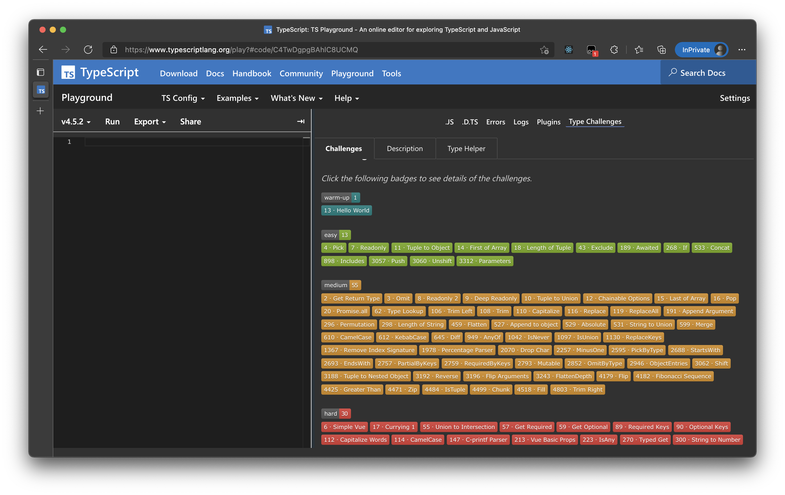

## @type-challenges/playground-plugin

[简体中文](./README.zh-CN.md)

TypeScript Playground Plugin for [Type Challenges](https://github.com/type-challenges/type-challenges).


Supported Features:

- [x] Pick question in challenge list
- [x] Switch languages
- [x] Copy and share answer to GitHub issue
- [x] Quick start next question
- [x] Quick find solutions

## Getting Started

### Step 1

[Open TypeScript Playground with Plugin](https://www.typescriptlang.org/play?install-plugin=%40type-challenges%2Fplayground-plugin)

### Step 2


Confirm "OK".

### Step 3



Start the challenge in TypeScript Playground!

## Contributing

See [CONTRIBUTING.md](./CONTRIBUTING.md) for the full details, however, TLDR:

```sh
git clone ...
yarn
yarn start
```

tick the **Connect to localhost:5000** in bottom of Plugins Panel, and refresh browser page.
