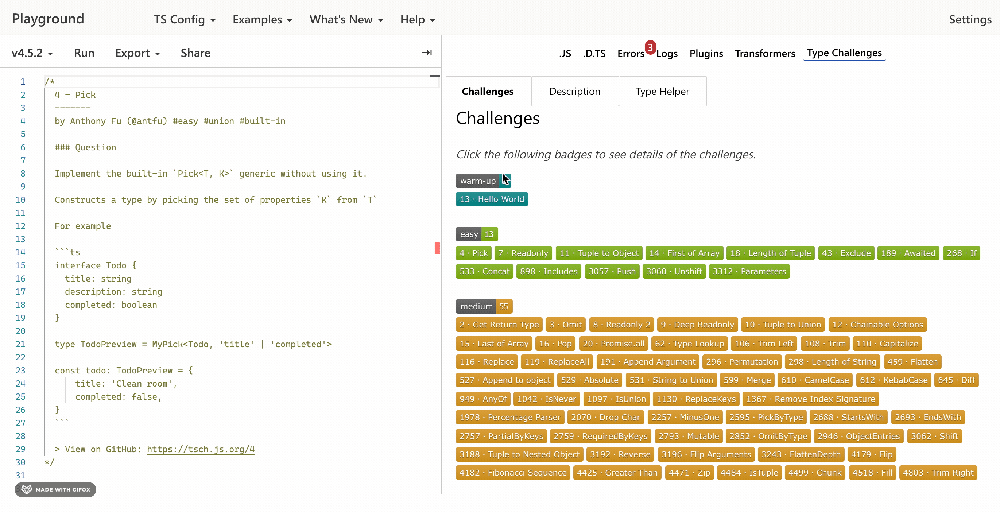
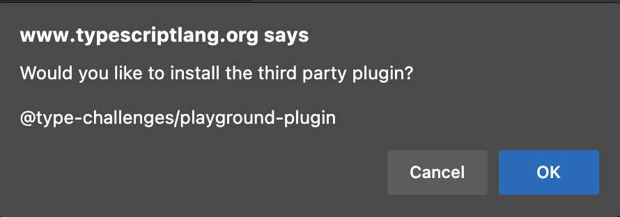
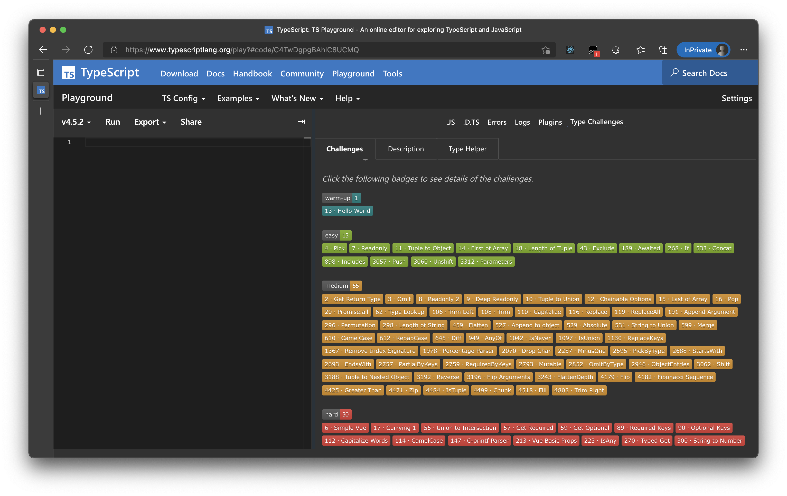

## @type-challenges/playground-plugin

[English](./README.md)

在 TypeScript Playground 中轻松练习 [Type Challenges](https://github.com/type-challenges/type-challenges)。



功能支持：

- [x] 从题目列表中选择，直接进入答题模式
- [x] 语言切换
- [x] 复制答案跳转至 GitHub issue 进行分析
- [x] 下一题快捷按钮
- [x] 快速定位解答列表

## 起步

### 步骤一

[点击链接，打开 TypeScript Playground](https://www.typescriptlang.org/play?install-plugin=%40type-challenges%2Fplayground-plugin)

### 步骤二



确认安装插件。

### Step 3



开始挑战吧！

## 如何贡献代码

完整信息请参阅 [CONTRIBUTING.md](./CONTRIBUTING.md)，简单描述：

```sh
git clone ...
yarn
yarn start
```

勾选 Plugin 面板底部的 **Connect to localhost:5000** 选项，并刷新页面。
